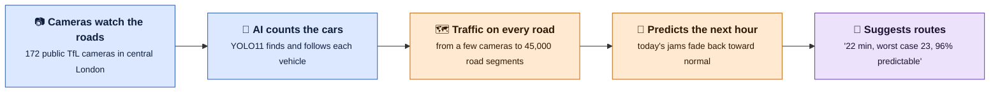
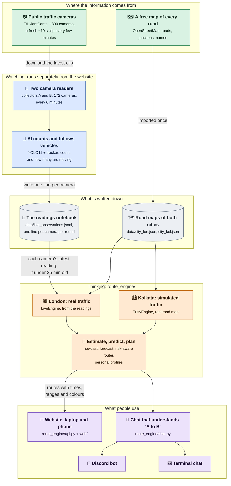
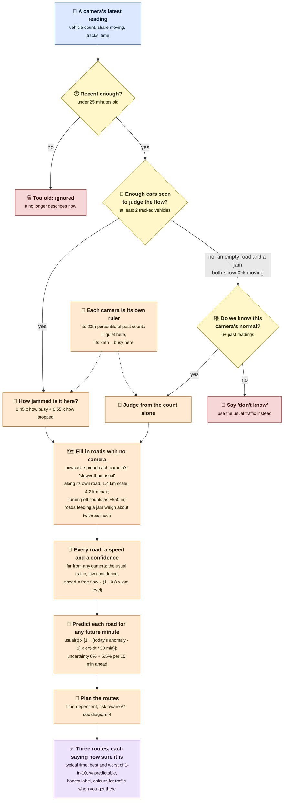
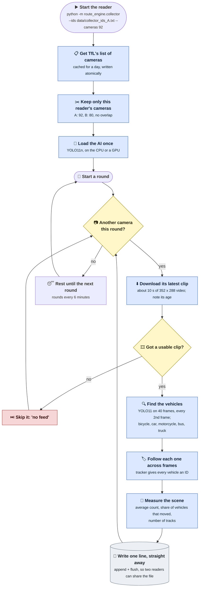
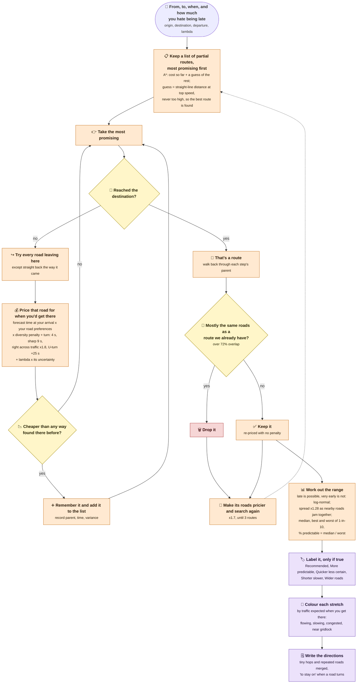
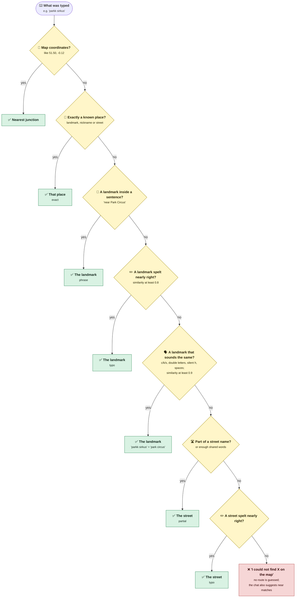
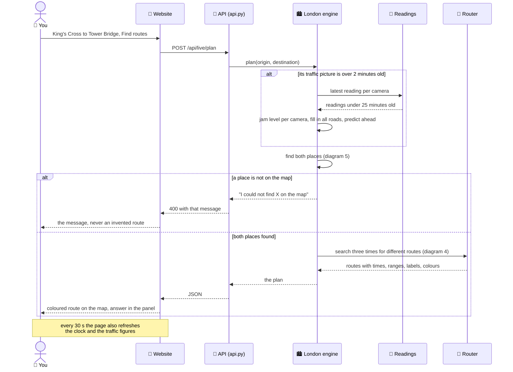
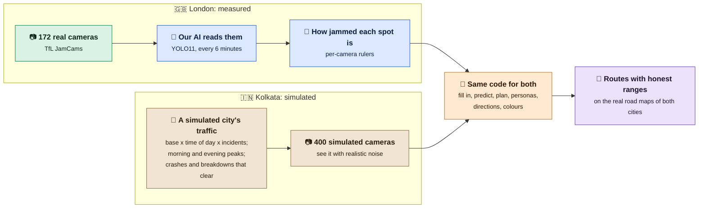
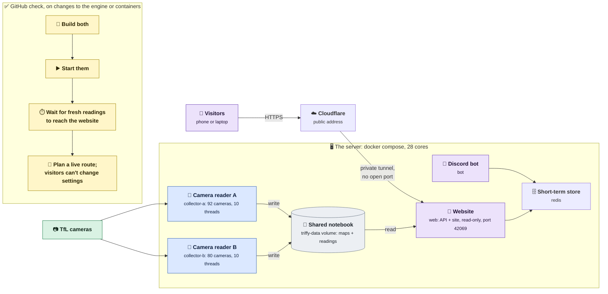
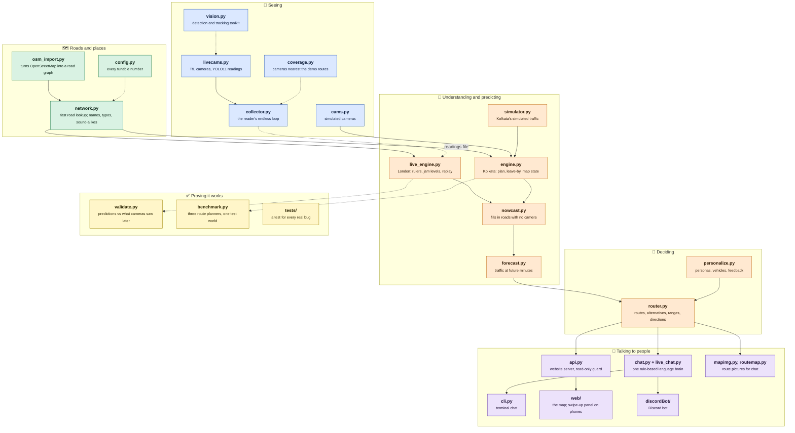

# How Triffy works

Every diagram here reads on two levels. The **bold line** in each box says what
happens in plain words; the small text underneath is the technical detail, for
anyone who wants to check it against the code. GitHub draws the diagrams from
the text below (Mermaid), and every number in them is the one the code uses.

| # | Diagram | In one line |
|---|---|---|
| 0 | [The 30-second version](#0-the-30-second-version) | the whole idea in five steps |
| 1 | [The system](#1-the-system) | the parts, and what flows between them |
| 2 | [From a camera to a route](#2-from-a-camera-to-a-route) | how a video clip becomes a prediction |
| 3 | [Inside a collector](#3-inside-a-collector) | how cameras are read, over and over |
| 4 | [Inside the router](#4-inside-the-router) | how the best routes are found |
| 5 | [From a name to a place](#5-from-a-name-to-a-place) | how "Parkk Sirkus" becomes Park Circus |
| 6 | [One request, end to end](#6-one-request-end-to-end) | what happens when you press Find routes |
| 7 | [Two cities, one engine](#7-two-cities-one-engine) | what is real and what is simulated |
| 8 | [Deployment](#8-deployment) | how it runs on the server, and how that is tested |
| 9 | [Where the code lives](#9-where-the-code-lives) | which file does what |

Colours used throughout: **green** open data, **blue** sensing, **grey** stored
data, **orange** prediction, **purple** what people use, **yellow** a decision,
**red** something set aside.

---

## 0. The 30-second version

**In plain words:** Triffy watches London's public traffic cameras, counts the
cars itself, works out the traffic on every road, predicts how it will change,
and suggests routes with an honest "how sure are we".

---

## 1. The system

**In plain words:** one part of Triffy watches cameras and writes down what it
sees; another part reads those notes and answers people's questions. They share
a notebook (a data file), so either can restart without breaking the other.

---

## 2. From a camera to a route

**In plain words:** a short video becomes a count of cars; the count becomes
"how jammed is this spot"; that spreads to nearby roads; then Triffy predicts
ahead and plans. The yellow diamonds are checks that stop bad or old data
from fooling it.

---

## 3. Inside a collector

**In plain words:** a camera reader goes round its list of cameras again and
again: download the latest clip, let the AI count and follow the cars, write
one line, move to the next. Two readers split the cameras between them.

---

## 4. Inside the router

**In plain words:** like a sat-nav, it keeps a list of "most promising ways so
far" and extends the best one until it reaches you; but it prices every road at
the time you will actually drive it, adds a cost for being unsure, then looks
again for genuinely different alternatives.

---

## 5. From a name to a place

**In plain words:** people type places messily. Triffy tries the strictest
match first and only loosens up if needed, and if nothing fits it says so
instead of guessing.

---

## 6. One request, end to end

**In plain words:** you ask for a route; the website asks the engine; the engine
refreshes its picture of the traffic if it is more than 2 minutes old, finds
both places, and plans. If a place can't be found, you are told, never given a
made-up route.

---

## 7. Two cities, one engine

**In plain words:** London's traffic is measured by Triffy from real cameras.
Kolkata's cameras aren't public, so its traffic is simulated on its real road
map. After that first step, both cities go through exactly the same code.

---

## 8. Deployment

**In plain words:** everything runs on one server, in separate boxes
(containers). Visitors reach it through Cloudflare. Before any change goes
live, GitHub builds and tries the same setup on a spare machine.

The camera readers keep about 16 of the server's 28 cores busy (each camera
costs about 34 CPU-seconds a reading) and run at a quarter of the website's
CPU priority, so pages stay quick.

---

## 9. Where the code lives

**In plain words:** each file has one job. Arrows show which file hands its
results to which; dotted lines are looser links (through a data file, or
settings).

See also: [starting Triffy](starting.md), [replay mode](replay.md), and the
[data guide](../README_ankan.md).
